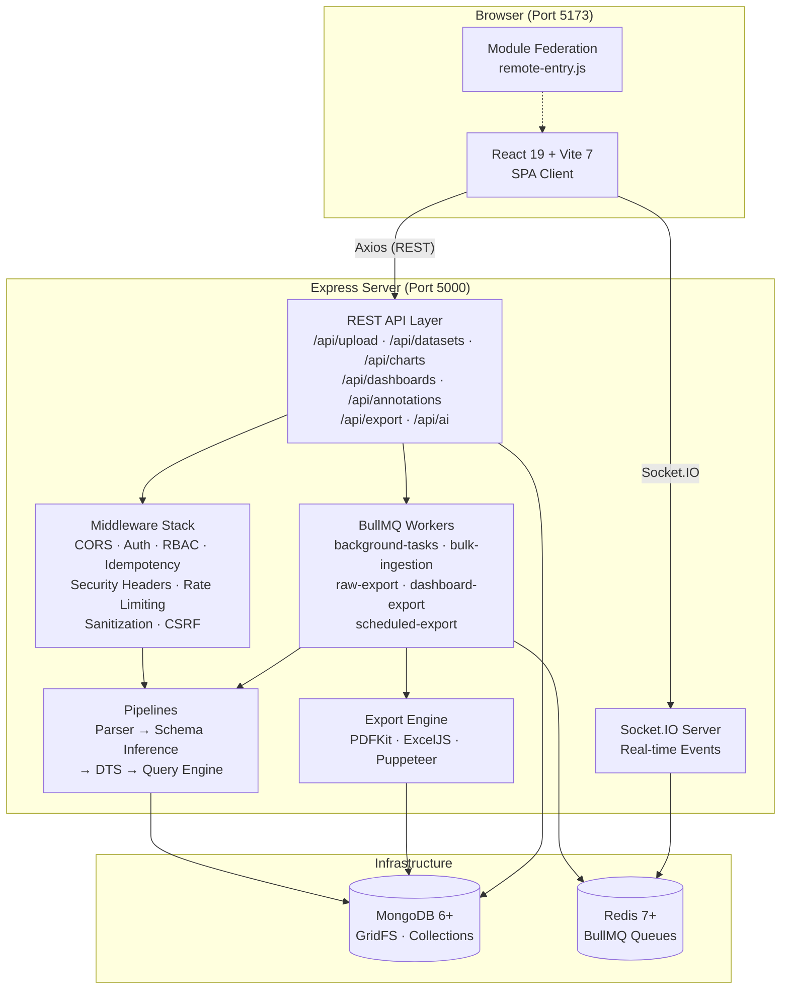
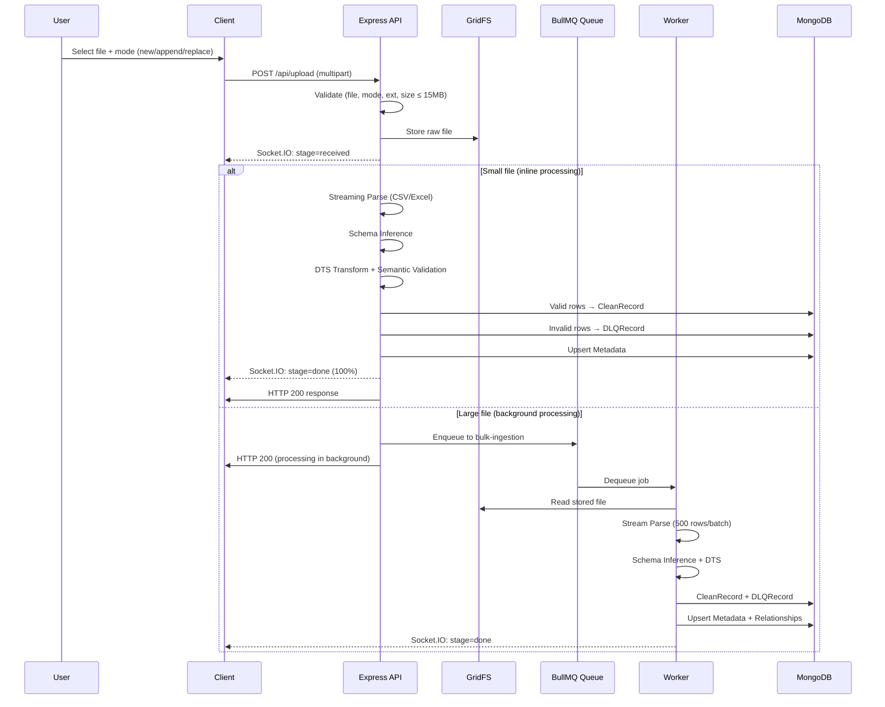
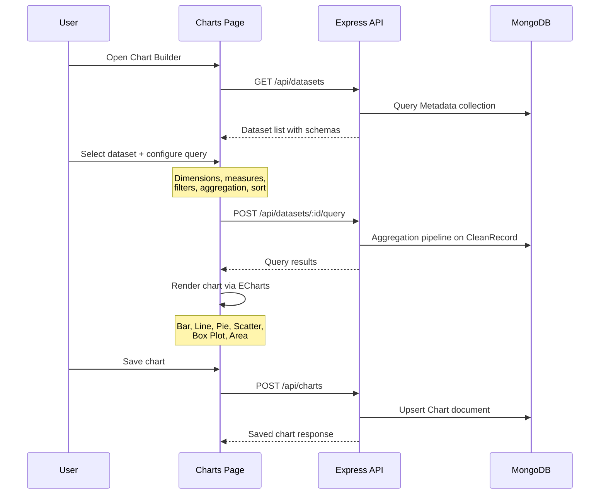
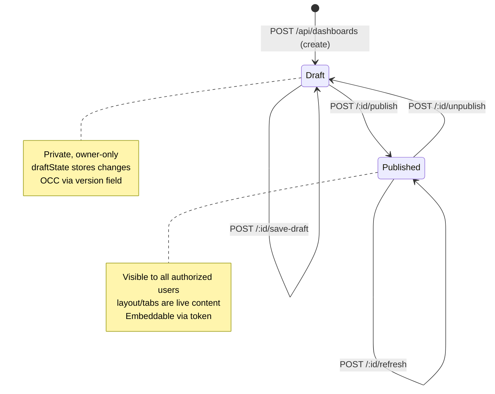
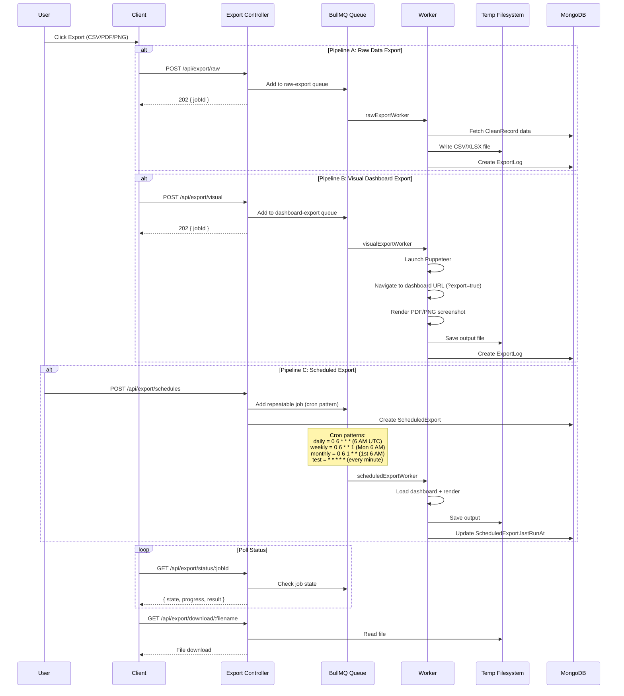
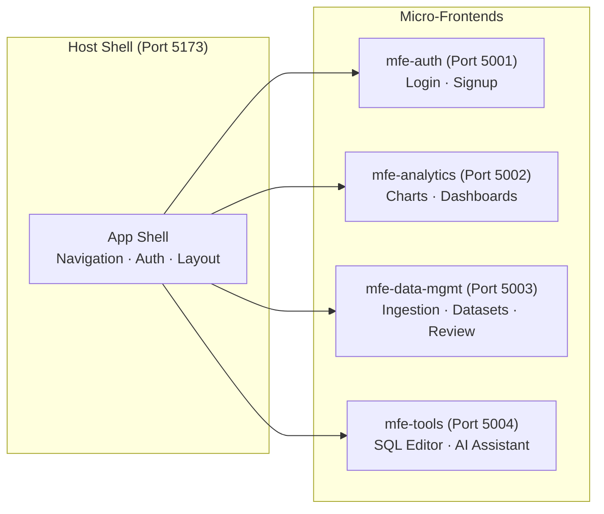
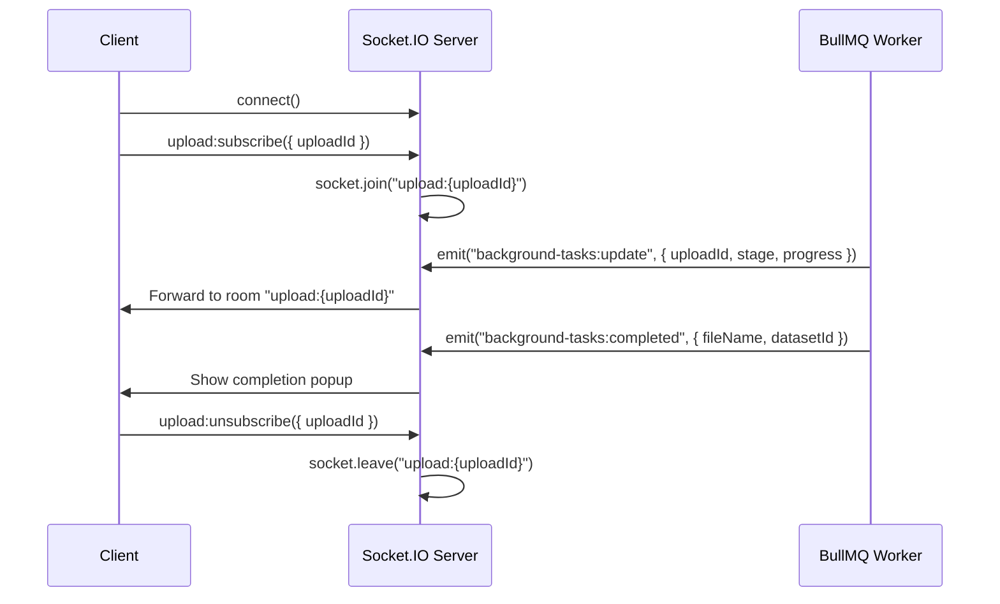

# Analytics BI — Architecture

## High-Level Architecture Diagram

---

## Data Flow

### 1. File Upload → Transformation → Clean Pipeline → MongoDB

### 2. User Creates Chart → Selects Dataset → Render via ECharts

### 3. Dashboard Publish Flow

### 4. Export Job Flow (CSV, PDF, Scheduled)

---

## Tech Stack Table

### Frontend

| Technology | Version | Purpose |
|------------|---------|---------|
| React | 19 | UI framework |
| Vite | 7 | Build tool & dev server |
| Apache ECharts | 6 | Charting & data visualization |
| Axios | — | HTTP client for REST API |
| Socket.IO Client | 4 | Real-time progress updates |
| React Router | — | Client-side routing |
| Lucide React | — | Icon library |
| html2canvas | 1.4 | Client-side screenshot capture |
| `@originjs/vite-plugin-federation` | 1.4 | Module Federation for microfrontends |

### Backend

| Technology | Version | Purpose |
|------------|---------|---------|
| Express | 5 | HTTP server & routing |
| Mongoose | 9 | MongoDB ODM |
| BullMQ | 5 | Background job processing |
| IORedis | 5 | Redis client (BullMQ dependency) |
| Socket.IO | 4 | WebSocket server for real-time events |
| Busboy | — | Streaming multipart file parsing |
| fast-csv | — | CSV parsing during ingestion |
| ExcelJS | — | XLSX reading & writing |
| PDFKit | — | PDF document generation |
| Puppeteer | — | Headless Chrome for visual exports |
| AJV | — | JSON Schema validation |
| json2csv | — | CSV serialization for exports |
| date-fns | — | Date utilities |
| Lodash | — | General utilities |
| dotenv | — | Environment variable loading |
| Nodemon | — | Development auto-reload |

### Infrastructure

| Technology | Version | Purpose |
|------------|---------|---------|
| MongoDB | 6+ | Primary database + GridFS file storage |
| Redis | 7+ | Job queues & worker coordination |
| Docker Compose | — | Container orchestration |
| Node.js | 18+ | Server runtime |

---

## Microfrontend Structure

Analytics BI is architected with Module Federation support via `@originjs/vite-plugin-federation`. The system is designed as a **host + remote** pattern:

**Implementation status**: All MFE directories exist under `apps/` with real code:

- **`apps/host/`**: Full app shell with `MFELoader.jsx`, `ErrorBoundary.jsx`, `Layout.jsx`, event bus, and auth bridge
- **`apps/mfe-auth/`**: `LoginPage.jsx`, `SignUpPage.jsx`, `remote-entry.js`, `bootstrap.jsx`
- **`apps/mfe-analytics/`**: `ChartsPage.jsx`, `DashboardPage.jsx`, `remote-entry.js`, `bootstrap.jsx`
- **`apps/mfe-data-mgmt/`**: `IngestionPage.jsx`, `DatasetsPage.jsx`, `DataReviewPage.jsx`, `remote-entry.js`
- **`apps/mfe-tools/`**: `BuilderPage.jsx`, `SettingsPage.jsx`, `SqlEditorPage.jsx`, `remote-entry.js`
- **`apps/shared-lib/`**: Shared utilities (`apiClient.js`, `authBridge.js`, `eventBus.js`, `env.js`)

The host's `vite.config.js` declares federation remotes pointing to each MFE's `remoteEntry.js`. Shared dependencies (`react`, `react-dom`, `react-router-dom`) are configured as singletons. The monolithic client (`apps/client`) can also operate standalone or as a federated remote via its own `remote-entry.js`.

**Running the MFE stack**: `npm run dev:mfe` starts the host + all 4 remotes concurrently.

**Design intent**: Each MFE runs independently, communicates via shared services and the REST API, and can be deployed/updated independently.

---

## Real-time Communication

**Events**:

| Event | Direction | Payload | Purpose |
|-------|-----------|---------|---------|
| `upload:subscribe` | Client → Server | `{ uploadId }` | Join progress room |
| `upload:unsubscribe` | Client → Server | `{ uploadId }` | Leave progress room |
| `background-tasks:update` | Server → Client | `{ uploadId, stage, progress, ... }` | Real-time progress |
| `background-tasks:completed` | Server → Client | `{ fileName, datasetId }` | Ingestion complete notification |

**Embed Socket**: A separate `embedSocket` module handles real-time communication for embedded dashboards, enabling data refresh without full page reloads.

---

## Scalability Considerations

### Horizontal Scaling

| Component | Strategy |
|-----------|----------|
| **Express API** | Stateless — can run behind a load balancer with multiple instances |
| **BullMQ Workers** | Workers connect to shared Redis — multiple processes can consume from the same queues |
| **MongoDB** | Supports replica sets and sharding; GridFS scales with the cluster |
| **Redis** | BullMQ supports Redis Cluster for high availability |

### Concurrency Control

- **Per-queue concurrency**: Configured via `CONCURRENCY_PROFILES` (LOW/MEDIUM/HIGH)
- **Global semaphore**: Caps total in-flight jobs across all queues (MEDIUM default: 15)
- **Bulk dispatch**: Large job arrays are chunked into batches of 50 to avoid Redis pipeline overload
- **Queue pause/resume**: Individual queues can be paused at runtime when downstream services degrade

### Data Pipeline

- **Streaming parsing**: Files are parsed as streams (not loaded entirely into memory)
- **Batch writes**: Worker writes rows in batches of 500 to MongoDB
- **GridFS**: Large uploaded files stored in GridFS to avoid the 16MB BSON document limit
- **Export file TTL**: Temporary export files cleaned up every 15 minutes (1-hour TTL)

### Resilience

- **Auto-port fallback**: Server scans up to 20 ports if the default is busy
- **In-memory MongoDB fallback**: Falls back to `mongodb-memory-server` if MongoDB is unreachable (development only)
- **Redis-optional startup**: Workers are disabled gracefully if Redis is unavailable; the REST API continues to function
- **Graceful shutdown**: `SIGINT`/`SIGTERM`/`SIGUSR2` handlers close workers, drain connections, and shut down cleanly
- **Stale job cleanup**: Export logs with `processing` status older than a threshold are auto-cleaned on startup

### Security at Scale

- **Rate limiting**: 1000 requests per IP per minute
- **Input sanitization**: Recursive HTML/script tag stripping on all inputs
- **SQL/NoSQL injection detection**: Pattern-based blocking
- **CSRF protection**: Token-based validation in production
- **Security headers**: CSP, X-Frame-Options (DENY), HSTS, and more
- **Idempotency middleware**: Prevents duplicate request processing via cached responses
