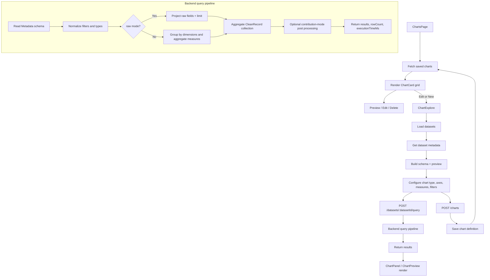
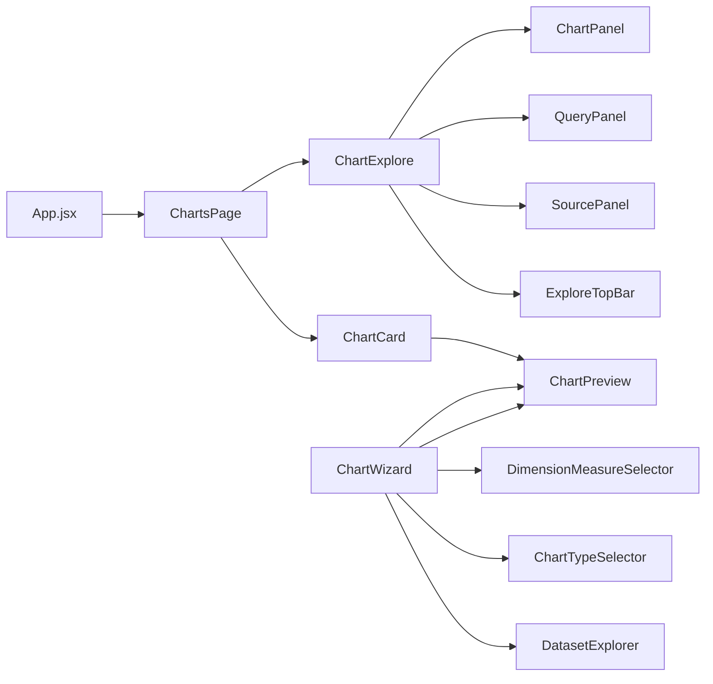
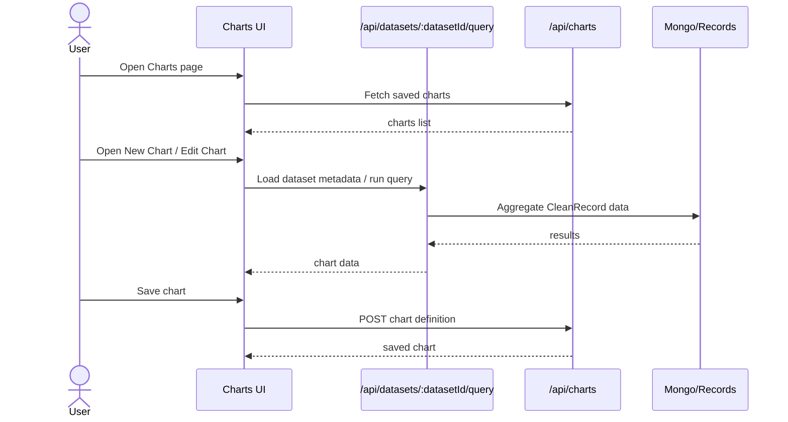
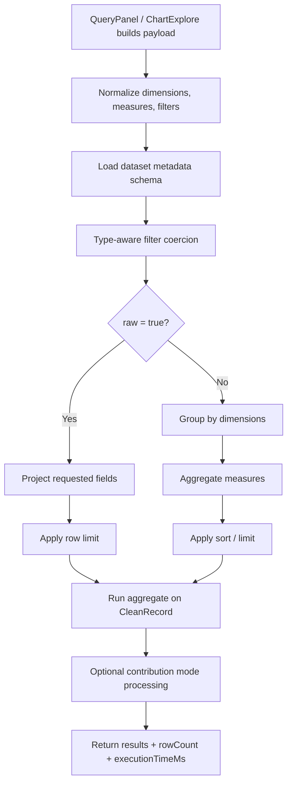

# Charts Module Overview

This document explains the client-side Charts module, how the pieces fit together, and how data moves from the UI to the backend and back into the chart renderer.

## What the module does

The Charts module provides two main experiences:

1. **Charts library page** — shows saved charts, lets users preview, edit, or delete them.
2. **Chart exploration/builder** — a Superset-style workspace for selecting a dataset, shaping a query, previewing results, and saving a chart.

The module is mounted from the main app when the Charts view is selected.

## Main files and responsibilities

### Entry and library view

- **ChartsPage**
  - Loads saved charts from the server.
  - Handles empty/loading/error states.
  - Switches between:
    - grid view of saved charts
    - full-page explore mode
    - modal preview of a saved chart
  - Signals to the parent app when explore mode is active.

- **ChartCard**
  - Represents one saved chart in the grid.
  - Fetches chart data for preview.
  - Handles view, edit, and delete actions.
  - Uses a special raw-data query for scatter charts.

### Explore / builder view

- **ChartExplore**
  - Full-page chart builder.
  - Loads datasets.
  - Loads schema/preview data for the selected dataset.
  - Restores an existing chart when editing.
  - Builds query payloads.
  - Auto-runs the query when configuration changes.
  - Saves chart definitions.
  - Renders the left source panel, middle query panel, and right chart panel.

- **ExploreTopBar**
  - Shows chart name, save button, dirty state, and back navigation.

- **SourcePanel**
  - Lets the user choose a dataset.
  - Shows searchable metrics and columns.
  - Supports quick assignment of dimensions and measures.
  - Restricts visible columns when the user is in aggregation selection mode.

- **QueryPanel**
  - Lets the user choose chart type.
  - Manages query controls for dimensions, measures, filters, legend, and grid settings.
  - Has a special flow for scatter and line/area charts.
  - Triggers query execution through the parent.

- **ChartPanel**
  - Renders the live chart preview in the explore view.
  - Renders tables for table mode.
  - Shows results and sample-data tabs.
  - Uses ECharts for bar, line, area, pie, and scatter rendering.
  - Shows a dirty-state warning when the query config has changed but has not been re-run.

### Wizard flow

- **ChartWizard**
  - A separate multi-step chart creation modal.
  - Uses a simpler step-by-step flow:
    1. dataset selection
    2. chart type selection
    3. dimension/measure assignment
    4. live preview and save
  - This component exists as an alternate flow, but it is not part of the main ChartsPage flow in the current client wiring.

- **DatasetExplorer**
  - Step 1 of the wizard.
  - Loads datasets and supports search.

- **ChartTypeSelector**
  - Step 2 of the wizard.
  - Lets the user pick bar, line, pie, area, or scatter.

- **DimensionMeasureSelector**
  - Step 3 of the wizard.
  - Lets the user assign fields to dimensions or measures.

- **ChartPreview**
  - Shared ECharts renderer used by the wizard and the saved-chart preview modal.
  - Builds chart options from chart type, result rows, dimensions, measures, and style.

## High-level user flow

1. User opens the Charts page.
2. The page fetches saved charts from the backend.
3. The user either:
   - opens a saved chart for preview,
   - edits a saved chart in explore mode, or
   - creates a new chart.
4. In explore mode, the user selects a dataset.
5. The client fetches dataset metadata and sample rows.
6. The user configures chart type, axes, measures, filters, and styling.
7. The client sends a query to the backend dataset query endpoint.
8. The backend runs an aggregation pipeline over cleaned records.
9. Results come back to the client and are rendered live.
10. If the user saves, the chart definition is stored in the charts collection.

## Dataflow diagram

## Component architecture diagram

## User journey diagram

## Query pipeline diagram

## Query pipeline in the backend

The Charts module depends on the dataset query endpoint for all live previews and saved-chart previews.

### 1. Input normalization

The backend receives:

- `dimensions`
- `measures`
- `filters`
- `orderBy`
- `sortBy`
- `raw`
- `rowLimit`
- `seriesLimit`
- `contributionMode`

It normalizes each value into arrays and clamps limits to safe bounds.

### 2. Schema lookup

The controller loads metadata for the selected dataset and builds a schema map.
This is used to infer column types before values are coerced.

### 3. Filter translation

Filters are converted into Mongo query conditions.
Type-aware coercion is applied for:

- numeric values
- booleans
- dates

### 4. Raw vs aggregated query

- **Raw mode**
  - Used mainly for scatter plots and other charts that need ungrouped rows.
  - Projects the requested fields directly.
  - Applies a row limit.

- **Aggregated mode**
  - Builds a `$group` stage.
  - Groups by dimensions.
  - Computes measures with `COUNT`, `SUM`, `AVG`, `MIN`, or `MAX`.
  - Adds `$project` and optional `$sort` stages.
  - Applies series or row limits.

### 5. Execution

The pipeline runs against the `CleanRecord` collection.
The response includes:

- `results`
- `rowCount`
- `executionTimeMs`

### 6. Contribution mode

If `contributionMode === "row"`, the result rows are post-processed so each metric becomes a percentage of the total.

## Save pipeline

When the user saves a chart from explore mode:

1. The UI builds a chart payload.
2. The payload includes:
   - chart name
   - dataset ID
   - query definition
   - visualization settings
   - style settings
3. The client posts the payload to `/api/charts`.
4. The backend maps the payload into the chart schema.
5. The chart is created or updated with an upsert.
6. The saved chart is then available in the charts grid.

## Renderer behavior

### `ChartPreview`

Used in:

- the wizard preview step
- the saved-chart preview modal

It supports:

- bar charts
- line charts
- area charts
- pie charts
- scatter plots

### `ChartPanel`

Used in explore mode.
It provides more than just rendering:

- live ECharts preview
- table mode
- results tab
- sample-data tab
- dirty-state warning

## Important implementation details

- Scatter charts always use raw rows because they need individual X/Y points.
- Line and area charts can also switch to raw mode when a measure uses `RAW` aggregation.
- Saved charts store both the query definition and visualization config, so the preview can be reconstructed later.
- The Charts page uses the same backend query endpoint as the explore builder, so saved-chart previews and live exploration stay consistent.
- The wizard and the full explore builder overlap in purpose, but the full explore builder is the main operational flow in this module.

## Summary

The Charts module is a complete chart authoring and preview system:

- `ChartsPage` manages saved charts and entry points.
- `ChartExplore` is the main chart-building workspace.
- `QueryPanel` and `SourcePanel` shape the query.
- `ChartPanel` and `ChartPreview` render chart results.
- The backend query endpoint transforms the user config into a Mongo aggregation pipeline.
- The chart save endpoint persists the chart definition for later reuse.
