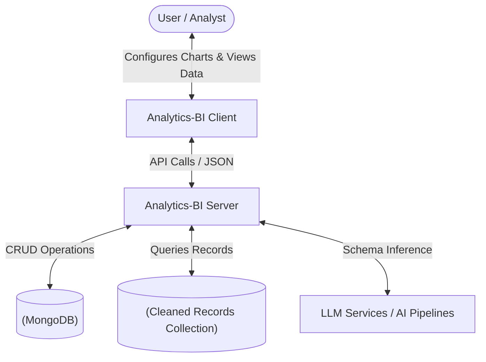
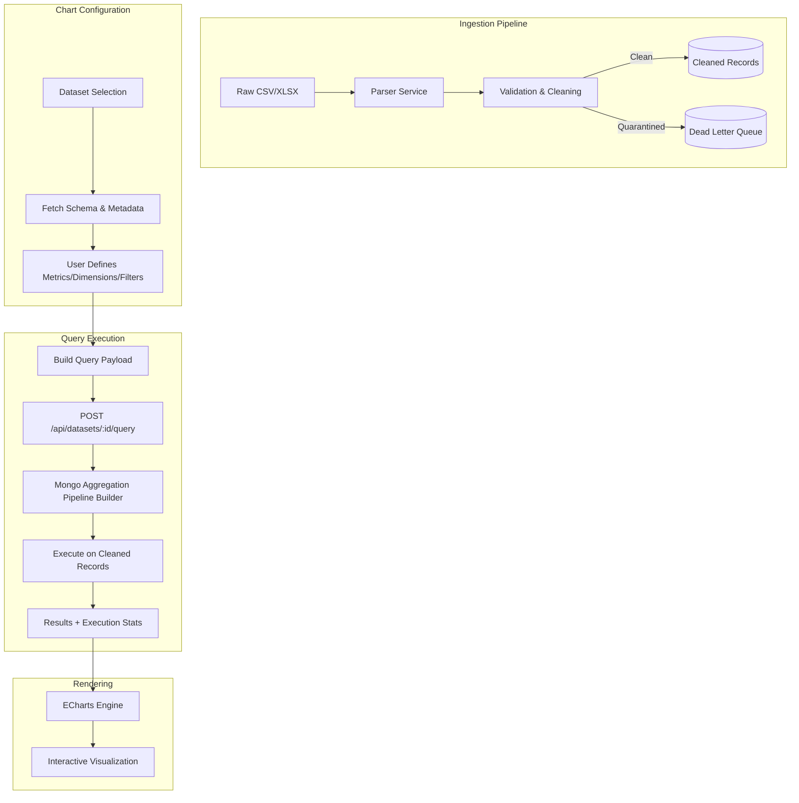
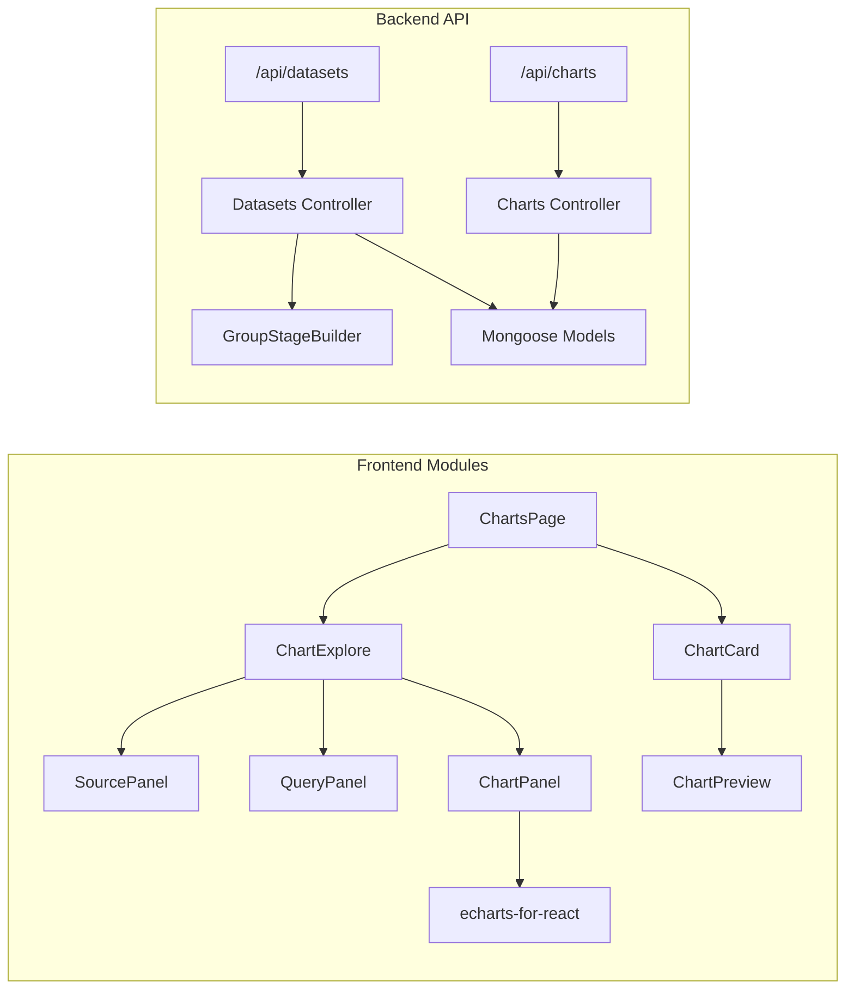

# Charts Module Documentation

This document provides a comprehensive engineering overview of the Charts module in the Analytics-BI platform. It covers the architecture, data flow, component structure, and technical implementation details.

---

## 1. System Context Diagram

The Context Diagram shows how the Charts module sits within the broader ecosystem, interacting with users and external entities.

---

## 2. Data Flow Diagram (DFD)

The Data Flow Diagram illustrates how information moves from the raw dataset ingestion to the final visualization on the user's screen.

---

## 3. Structured Diagram (System Architecture)

The following diagram shows the hierarchical organization of components and modules involved in charting.

---

## 4. Engineering Details

### 4.1 Frontend Architecture

The frontend is built with **React** and utilizes a modular approach for decoupling data management from presentation.

*   **State Management**: `ChartExplore` acts as the orchestrator, maintaining the complex state of the current query (dimensions, measures, filters, and visualization settings).
*   **Visualization Engine**: We use **ECharts** (via `echarts-for-react`) for its high performance and extensive customization options.
*   **Dirty State Tracking**: The UI tracks changes in parameters. If a parameter is changed but not yet executed, a "Dirty State" warning is shown to ensure the user is viewing up-to-date data.
*   **Responsive Rendering**: All charts are wrapped in a `ResizeObserver` to ensure they adapt perfectly to different screen sizes and panel collapses.

### 4.2 Backend Query Pipeline

The query pipeline is designed for scalability and flexibility, converting high-level chart configurations into optimized MongoDB aggregation pipelines.

1.  **Normalization & Validation**: Incoming requests are validated, and parameters are coerced into correct types (e.g., converting string "100" to Number 100 for filters on numeric columns).
2.  **Aggregation Building**:
    *   **Group Stage**: Dimensions are mapped to the `_id` of the `$group` stage.
    *   **Project Stage**: Measures are computed using operators like `$sum`, `$avg`, `$min`, `$max`, and `$count`.
    *   **Sorting**: Supports multi-column sorting based on both dimensions and measures.
3.  **Raw Mode**: For Scatter plots, the pipeline bypasses grouping and projects raw records with defined limits.
4.  **Contribution Mode**: A post-processing step that calculates the percentage contribution of each row to the total sum of the metrics.

### 4.3 Data Models

*   **Metadata**: Stores information about datasets, including schema-inferred types, roles (dimension vs. measure), and row counts.
*   **Charts**: Stores saved chart definitions, including the query payload and visual configuration (colors, legend settings, etc.).
*   **CleanRecord**: The optimized storage for ingested data, indexed by `datasetId` for fast retrieval.

---

## 5. Technology Stack Summary

| Layer | Technology |
| :--- | :--- |
| **Frontend** | React, Lucide Icons, Vanilla CSS |
| **Charts** | ECharts (echarts-for-react) |
| **Backend** | Node.js, Express |
| **Database** | MongoDB |
| **Diagrams** | Mermaid JS |

---

## 6. Engineering Challenges & Solutions

*   **Numeric vs. Categorical Axes**: Implementation of a heuristic to detect numeric X-axes in line/area charts to allow for continuous scale rendering vs. discrete category grouping.
*   **Performance at Scale**: Aggregations are performed directly in the database layer to minimize data transfer. Results are limited to 50k rows to protect browser memory.
*   **Idempotency**: Bulk inserts of cleaned records use `ordered: false` to handle intermittent failures and retries gracefully.
