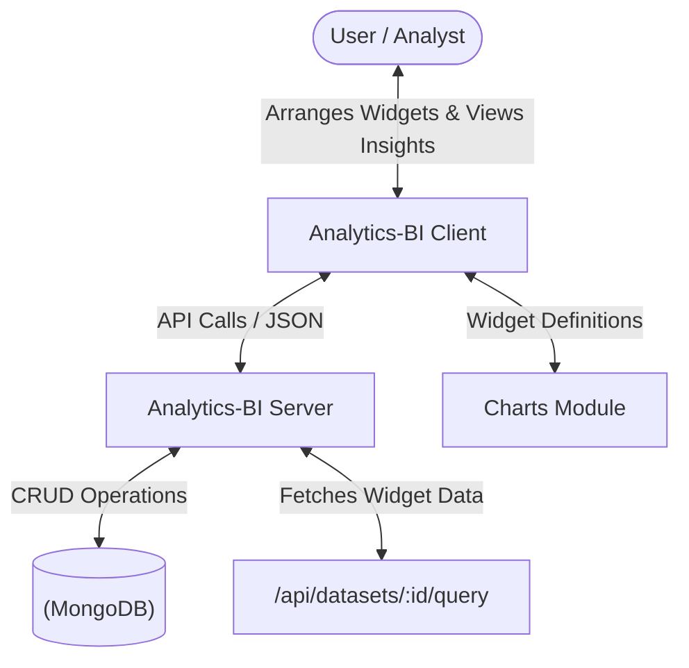
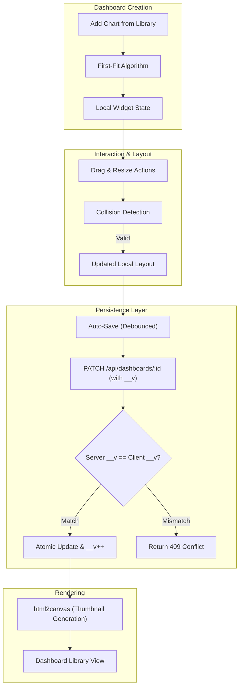
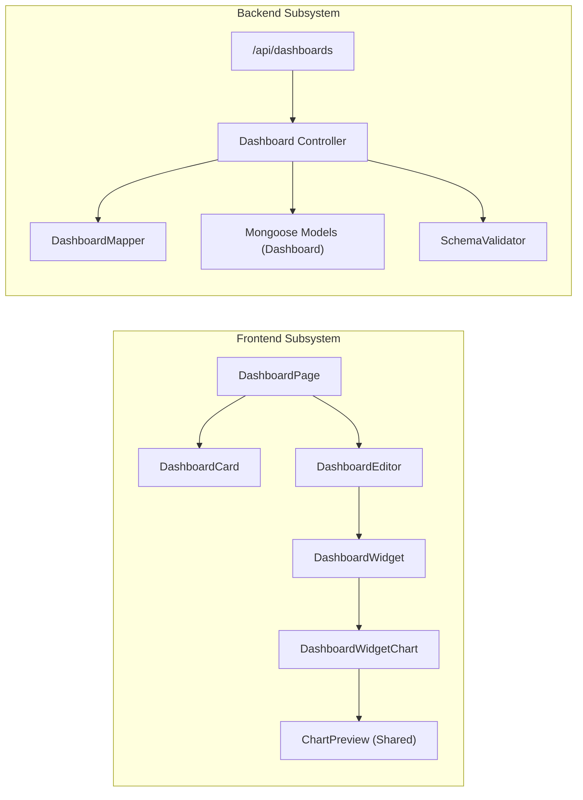

# Dashboard Module Documentation

This document provides a comprehensive engineering overview of the Dashboard module in the Analytics-BI platform. It explores the architecture, state management with concurrency control, and the interactive grid system.

---

## 1. System Context Diagram

The Context Diagram shows how the Dashboard module integrates with the Charts and Datasets modules to provide a unified data visualization interface.

---

## 2. Data Flow Diagram (DFD)

The Data Flow Diagram illustrates the lifecycle of a dashboard, from adding charts to persistent storage with optimistic concurrency control.

---

## 3. Structured Diagram (System Architecture)

The following diagram shows the relationship between the dashboard components and the underlying services.

---

## 4. Engineering Details

### 4.1 Frontend Interactive Grid

The dashboard layout engine is custom-built to support a responsive, coordinate-based grid system.

*   **First-Fit Algorithm**: When a new chart is added, the `findFirstFit` function scans the grid to find the first available space where the widget can fit without overlapping others.
*   **Collision Detection**: Both the frontend (`canPlaceWidget`) and backend (`validateLayout`) enforce a strict "no-overlap" policy using Axis-Aligned Bounding Box (AABB) intersection tests.
*   **Thumbnail Generation**: Upon manual saving, `html2canvas` is used to capture a screenshot of the dashboard grid, which is stored as a base64-encoded JPEG thumbnail for the library view.
*   **Data Orchestration**: Each widget independently manages its data fetching through `DashboardWidgetChart`, using a global `previewDataCache` to prevent redundant network requests when multiple widgets share the same query.

### 4.2 Backend Persistence & OCC

The dashboard backend implements high-reliability persistence strategies to handle simultaneous edits.

*   **Optimistic Concurrency Control (OCC)**: The `patchDashboardState` endpoint requires the client to send the current version (`__v`). The server only performs the update if the version matches, preventing "lost updates" from stale client states.
*   **Partial Updates**: The system supports partial state updates (autosaves), allowing specific fields like `layout`, `filters`, or `title` to be merged into the existing document.
*   **Atomic Increment**: Every successful update increments the `__v` field using MongoDB's `$inc` operator, ensuring a strictly linear version history.

### 4.3 Data Models

*   **Dashboard State**: A JSON-serialized representation of the dashboard's widgets, including their positions (`x`, `y`), dimensions (`w`, `h`), and references to chart IDs.
*   **Layout Persistence**: While `__v` handles concurrency, the `layout` array is the primary source of truth for the spatial arrangement of data visualizations.

---

## 5. Technology Stack Summary

| Layer | Technology |
| :--- | :--- |
| **Grid Engine** | Custom React Grid logic |
| **Icons** | Lucide-react |
| **Screenshot** | html2canvas |
| **Backend** | Node.js / Express |
| **ORM** | Mongoose |
| **Diagrams** | Mermaid JS |

---

## 6. Key Engineering Challenges

*   **Sub-pixel Rendering**: Ensuring the coordinate-based grid renders consistently across different screen resolutions by calculating cell widths as a percentage of the container width.
*   **Collision Complexity**: Maintaining $O(N^2)$ collision detection efficiency for real-time dragging and resizing of widgets.
*   **State Sync**: Orchestrating a clean "Edit vs. Read-Only" mode toggle while maintaining a persistent debounced auto-save loop.
